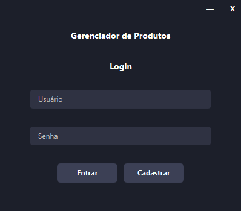
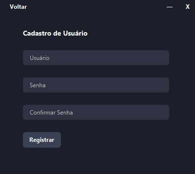
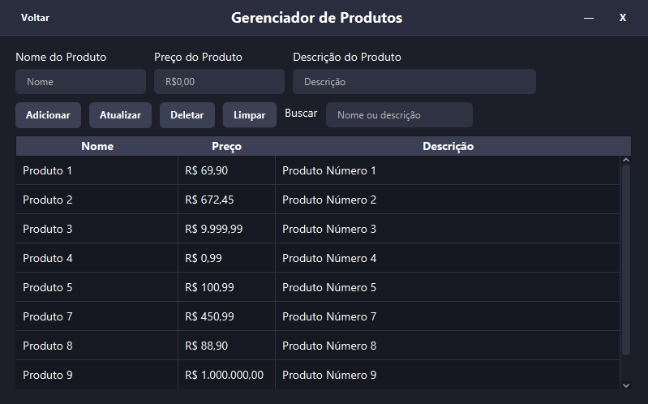

# 🛒 Products Manager

Aplicação Java Desktop para gerenciamento de produtos, com autenticação de usuários, construída com JavaFX, JPA (Hibernate), MySQL, Maven e seguindo os padrões **MVC + DAO**.

---

## 💡 Sobre o projeto

O **Products Manager** é um projeto CRUD simples, com interface gráfica, criado para colocar em prática os conhecimentos adquiridos durante a faculdade e estudos complementares em Java. Seu principal objetivo é demonstrar domínio de boas práticas, arquitetura de software e integração com banco de dados em uma aplicação real.

O projeto inclui autenticação de usuários com senha criptografada (BCrypt), persistência de dados com JPA/Hibernate e uma interface em JavaFX para realizar operações com produtos.

---

## 🖼️ Screenshots

### 🔐 LoginView

### 🧾 RegisterView

### 📋 MainView

---

## 💻 Como executar

**Instale o Docker e Docker Compose, caso ainda não os possua.**

Na raiz do projeto, execute:

`docker compose up -d`

**O container iniciará um banco MySQL na porta 3307 e criará o banco pm_appdb utilizando o script localizado em /sql.**

Execute o projeto:

Rode a classe `Main.java`, localizada em:

`src/main/java/br/com/michael/productsmanager/view/Main.java`

---

## 🔐 Como usar

1. **Login:**
   - Insira seu nome de usuário e senha, ou clique em "Registrar" se ainda não tem uma conta.
2. **Cadastro:**
   - Informe um nome único e uma senha (sem restrições específicas).
   - Confirme a senha e clique em "Registrar".
3. **Tela principal:**
   - Realize operações CRUD (Criar, Ler, Atualizar, Excluir) sobre os produtos.
   - Cada produto possui: **nome**, **preço (em R$)** e **descrição**.
   - Use o botão "Limpar" para resetar os campos de texto.

---

## 🧱 Estrutura do projeto

- `model` → Entidades JPA.
- `dao` → Camada de persistência (DAO).
- `controller` → Lógica das telas e ações.
- `view` → Telas FXML e classe `Main`.
- `util` → Classe de configuração com `database.properties`.
- `session` → Classe para manter o estado do usuário logado.

---

## 📄 Documentação

- A documentação gerada com **JavaDoc** está disponível na pasta `/docs`.

---

## 🚧 Próximas melhorias (roadmap)

- Gerar um instalador da aplicação com **JPackage**.
- Melhorar o layout e a experiência visual da interface.

---

## 👨‍💻 Autor

Desenvolvido por **Michael Nascimento** — estudante de Análise e Desenvolvimento de Sistemas e aspirante a desenvolvedor backend Java.

📧 Email: [michael.nascimentodev@gmail.com](mailto:michael.nascimentodev@gmail.com)  
🔗 LinkedIn: [linkedin.com/in/michael-nascimento-675847277](https://www.linkedin.com/in/michael-nascimento-675847277/)

---

⭐ **Se você gostou do projeto, considere deixar uma estrela!**
